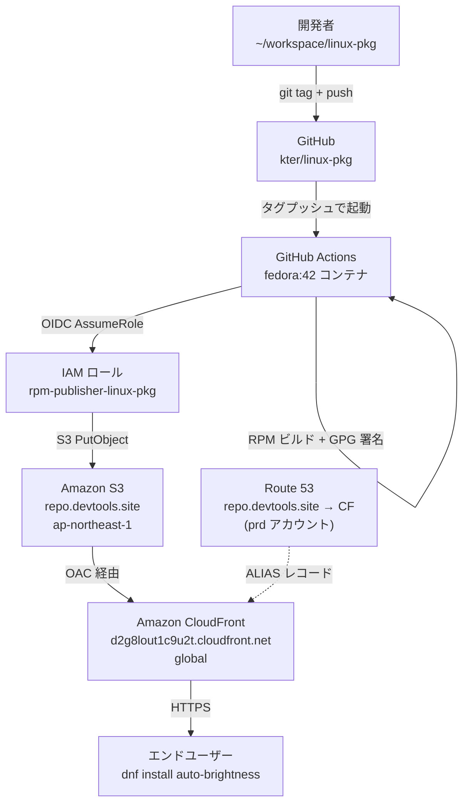

# アーキテクチャ

## システム全体像



## コンポーネント一覧

| コンポーネント | 役割 | 識別子 / ARN |
|---|---|---|
| S3 バケット | RPM ファイルと repodata の保存 | `repo.devtools.site` (ap-northeast-1) |
| CloudFront ディストリビューション | CDN + HTTPS + カスタムドメイン | `ES4NVQ58B8G82` |
| CloudFront OAC | S3 へのアクセス制御（S3 パブリック公開不要） | `E3JCCWR5GPNG0C` |
| ACM 証明書 | `repo.devtools.site` の TLS | `arn:aws:acm:us-east-1:401731371959:certificate/f57eda94-be09-4168-b16c-16425484507a` |
| Route 53 ホストゾーン | DNS（devtools.site、prd アカウント） | `Z07774093R2W7AB97P21C` |
| IAM ロール | GitHub Actions からの S3 書き込み権限 | `rpm-publisher-linux-pkg` |
| GitHub リポジトリ | パッケージソース・CI 定義 | `github.com/kter/linux-pkg` |
| GPG キー | RPM パッケージと repomd.xml の署名 | `B6B7B12BC08AC187F689387FD3F38A4374088D52` |

## データフロー：リリースから `dnf install` まで

1. **ソース変更**: `packages/<name>/sources/` を更新 → `make sync-sources` で `linux-config` から同期
2. **タグ付け**: `git tag auto-brightness-1.x && git push origin auto-brightness-1.x`
3. **CI 起動**: GitHub Actions が `fedora:42` コンテナを起動
4. **RPM ビルド**: `rpmbuild -bb` で `.noarch.rpm` を生成
5. **GPG 署名**: `rpmsign --addsign` で RPM に署名（`GPG_PRIVATE_KEY` Secret から鍵をインポート）
6. **AWS 認証**: OIDC で `rpm-publisher-linux-pkg` ロールを assume（Secret なし）
7. **S3 同期**: 既存 RPM を取得 → 新 RPM を追加 → `createrepo_c --update` でメタデータ再生成
8. **repomd.xml 署名**: `gpg --detach-sign` で `repomd.xml.asc` を生成
9. **S3 アップロード**: `aws s3 sync --delete` でリポジトリ全体をアップロード
10. **CloudFront 配信**: ユーザーが `dnf install` → `repo.devtools.site` → CloudFront → S3

## セキュリティ境界

```
┌─────────────────────────────────────────────────────┐
│ GitHub Actions                                      │
│  ┌─────────────────────────────────────────────┐   │
│  │ GPG 署名                                    │   │
│  │  - RPM パッケージ本体に署名                 │   │
│  │  - repomd.xml に署名（repo_gpgcheck 対応）  │   │
│  └─────────────────────────────────────────────┘   │
│  ┌─────────────────────────────────────────────┐   │
│  │ OIDC 認証（GitHub → AWS）                  │   │
│  │  - 長期クレデンシャル不要                   │   │
│  │  - repo:kter/linux-pkg:* に限定             │   │
│  └─────────────────────────────────────────────┘   │
└─────────────────────────────────────────────────────┘

┌─────────────────────────────────────────────────────┐
│ AWS                                                 │
│  ┌─────────────────────────────────────────────┐   │
│  │ OAC（CloudFront → S3）                     │   │
│  │  - S3 バケットはパブリックアクセス完全無効  │   │
│  │  - CloudFront からの GetObject のみ許可     │   │
│  └─────────────────────────────────────────────┘   │
└─────────────────────────────────────────────────────┘
```

## キャッシュ戦略

| パス | CloudFront TTL | 理由 |
|---|---|---|
| `rpm/noarch/repodata/*` | 0〜300秒 | リリース直後に dnf が最新版を参照できるよう短期 |
| `rpm/noarch/*.rpm` | 86400秒（1日） | RPM ファイルは内容が変わらない（バージョンで管理）|
| `RPM-GPG-KEY-kter` | デフォルト | 更新頻度が極めて低い |

## S3 バケット構造

```
s3://repo.devtools.site/
  rpm/
    noarch/
      auto-brightness-1.0-1.fc42.noarch.rpm
      auto-brightness-1.1-1.fc42.noarch.rpm
      kter-release-1-1.fc42.noarch.rpm
      repodata/
        repomd.xml
        repomd.xml.asc            # repo_gpgcheck 用
        <hash>-primary.xml.zst
        <hash>-filelists.xml.zst
        <hash>-other.xml.zst
  RPM-GPG-KEY-kter                # 公開鍵
```

## コスト試算（月額）

| 項目 | 試算 |
|---|---|
| S3 ストレージ（< 100MB） | ~$0.002 |
| S3 リクエスト（CloudFront からのオリジンフェッチ） | ~$0.001 |
| CloudFront データ転送（最初の 1TB 無料） | $0 |
| CloudFront リクエスト（最初の 10M 無料） | $0 |
| ACM 証明書 | $0 |
| Route 53 クエリ | ~$0.001 |
| **合計** | **~$0.01** |
